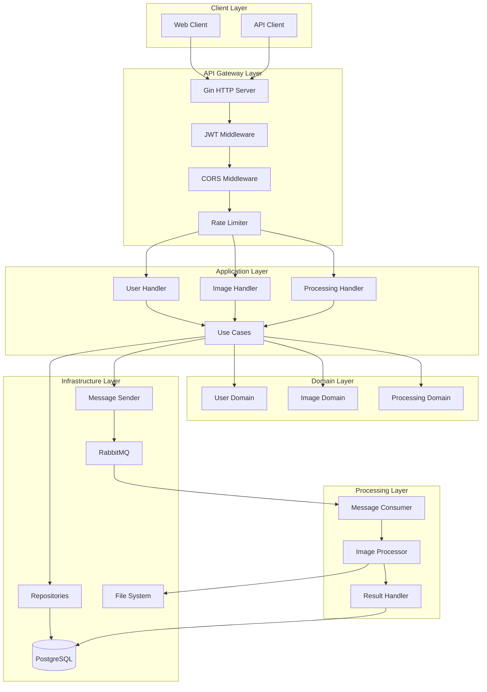
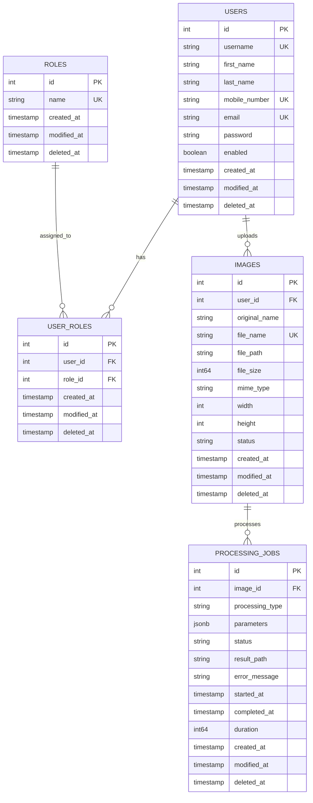
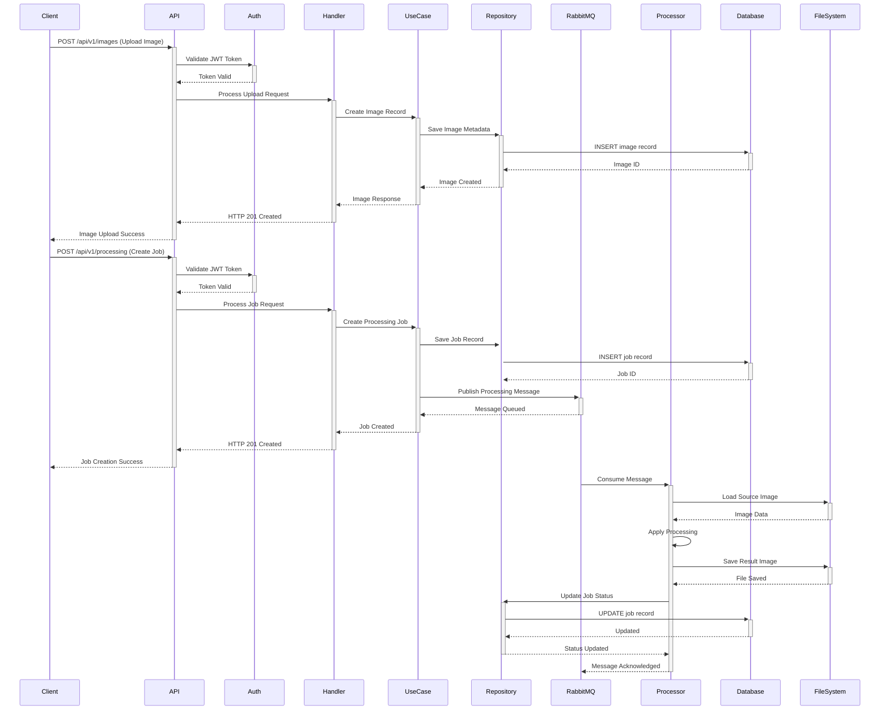

# Enterprise Image Processing Service

> **A high-performance, scalable Go-based microservice for asynchronous image processing with enterprise-grade features**

[](https://golang.org/)
[](LICENSE)
[](docker/docker-compose.yml)
[](https://www.rabbitmq.com/)
[](https://www.postgresql.org/)
[](#api-documentation)

**🔗 Project Source:** [roadmap.sh/projects/image-processing-service](https://roadmap.sh/projects/image-processing-service)  
**👨‍💻 Developer:** [@alielmi98](https://github.com/alielmi98)

---

## 📋 Table of Contents

- [🎯 Overview](#-overview)
- [🏗️ Architecture](#️-architecture)
- [💻 Technology Stack](#-technology-stack)
- [🗄️ Database Schema](#️-database-schema)
- [🚀 Features](#-features)
- [📊 System Flow](#-system-flow)
- [🛠️ Installation](#️-installation)
- [📖 API Documentation](#-api-documentation)
- [🔧 Configuration](#-configuration)
- [🐳 Docker Deployment](#-docker-deployment)
- [🧪 Testing](#-testing)
- [📈 Performance](#-performance)
- [🤝 Contributing](#-contributing)

---

## 🎯 Overview

This **Enterprise Image Processing Service** is a production-ready microservice built with **Go** that provides scalable, asynchronous image processing capabilities. Designed with **Clean Architecture** principles and **Domain-Driven Design**, it demonstrates advanced software engineering practices suitable for enterprise environments.

### 🎯 Key Highlights

- **🔄 Asynchronous Processing**: RabbitMQ-based message queuing for high throughput
- **🏗️ Clean Architecture**: Layered design with clear separation of concerns
- **🔐 Enterprise Security**: JWT authentication with role-based authorization
- **📊 Production Ready**: Comprehensive logging, monitoring, and error handling
- **🐳 Container Native**: Full Docker support with multi-environment configs
- **📈 Scalable Design**: Horizontal scaling support with connection pooling
- **🔧 Microservice Ready**: Designed for easy decomposition into microservices

---

## 🏗️ Architecture



### 🏛️ Architecture Patterns

- **🎯 Clean Architecture**: Clear separation between business logic and external concerns
- **🔄 CQRS Pattern**: Separate read/write operations for optimal performance
- **📨 Event-Driven**: Asynchronous processing with message queuing
- **🏭 Repository Pattern**: Data access abstraction layer
- **💉 Dependency Injection**: Loose coupling and testability
- **🎭 Middleware Pattern**: Cross-cutting concerns handling

---

## 💻 Technology Stack

### 🔧 Backend Technologies
| Technology | Version | Purpose |
|------------|---------|---------|
| **Go** | 1.22.2 | Core backend language |
| **Gin** | 1.10.1 | HTTP web framework |
| **GORM** | 1.30.1 | ORM for database operations |
| **PostgreSQL** | Latest | Primary database |
| **RabbitMQ** | Latest | Message broker |
| **JWT** | 3.2.2 | Authentication tokens |
| **Swagger** | 1.16.6 | API documentation |
| **Docker** | Latest | Containerization |

### 📚 Key Libraries
- **`disintegration/imaging`**: High-performance image processing
- **`didip/tollbooth`**: Rate limiting middleware
- **`google/uuid`**: UUID generation
- **`spf13/viper`**: Configuration management
- **`golang/crypto`**: Cryptographic operations

---

## 🗄️ Database Schema



### 🔑 Key Database Features
- **ACID Compliance**: Full transaction support
- **Indexing Strategy**: Optimized queries with strategic indexes
- **Soft Deletes**: Data preservation with audit trails
- **JSONB Support**: Flexible parameter storage
- **Foreign Key Constraints**: Data integrity enforcement

---

## 🚀 Features

### 🖼️ Image Processing Operations
| Operation | Description | Parameters |
|-----------|-------------|------------|
| **Resize** | Scale images to specific dimensions | `width`, `height`, `maintain_ratio`, `quality` |
| **Crop** | Extract specific regions | `x`, `y`, `width`, `height` |
| **Rotate** | Rotate by degrees | `angle` |
| **Filter** | Apply visual effects | `filter_type`, `intensity`, `options` |
| **Watermark** | Add overlay images | `position`, `opacity`, `scale` |
| **Compress** | Optimize file size | `quality`, `format` |
| **Format** | Convert between formats | `target_format`, `quality` |

### 🔐 Security Features
- **JWT Authentication**: Stateless token-based auth
- **Role-Based Authorization**: Granular permission control
- **Rate Limiting**: DDoS protection
- **Input Validation**: Comprehensive request validation
- **CORS Support**: Cross-origin resource sharing
- **Password Hashing**: Secure credential storage

### 📊 Monitoring & Observability
- **Structured Logging**: JSON-formatted logs
- **Health Checks**: Service availability monitoring
- **Metrics Collection**: Performance tracking
- **Error Tracking**: Comprehensive error handling
- **Audit Trails**: Complete operation history

---

## 📊 System Flow



---

## 🛠️ Installation

### 📋 Prerequisites
- **Go 1.22.2+**
- **PostgreSQL 13+**
- **RabbitMQ 3.8+**
- **Docker & Docker Compose** (optional)

### 🔧 Local Development Setup

```bash
# 1. Clone the repository
git clone https://github.com/alielmi98/image-processing-service.git
cd image-processing-service

# 2. Install dependencies
cd src
go mod download

# 3. Set up environment
cp pkg/config/config-development.yml pkg/config/config.yml

# 4. Start infrastructure services
docker-compose -f docker/docker-compose.yml up -d postgres rabbitmq

# 5. Run database migrations
go run cmd/main.go migrate

# 6. Start the application
go run cmd/main.go
```

### 🌐 Application URLs
- **API Server**: http://localhost:5005
- **Swagger UI**: http://localhost:5005/swagger/index.html
- **RabbitMQ Management**: http://localhost:15672 (admin/password)

---

## 📖 API Documentation

### 🔐 Authentication Endpoints
```http
POST /api/v1/auth/register    # User registration
POST /api/v1/auth/login       # User login
POST /api/v1/auth/refresh     # Token refresh
```

### 🖼️ Image Management Endpoints
```http
POST   /api/v1/images/        # Upload image
GET    /api/v1/images/{id}    # Get image details
GET    /api/v1/images/        # List user images
DELETE /api/v1/images/{id}    # Delete image
```

### ⚙️ Processing Endpoints
```http
POST /api/v1/processing       # Create processing job
GET  /api/v1/processing/{id}  # Get job status
GET  /api/v1/processing       # List user jobs
```

### 📝 Example Requests

#### Image Upload
```bash
curl -X POST http://localhost:5005/api/v1/images/ \
  -H "Authorization: Bearer YOUR_JWT_TOKEN" \
  -F "file=@image.jpg"
```

#### Create Processing Job
```bash
curl -X POST http://localhost:5005/api/v1/processing \
  -H "Authorization: Bearer YOUR_JWT_TOKEN" \
  -H "Content-Type: application/json" \
  -d '{
    "image_id": 1,
    "processing_type": "resize",
    "parameters": {
      "width": 800,
      "height": 600,
      "maintain_ratio": true,
      "quality": 90
    }
  }'
```

---

## 🔧 Configuration

### 📁 Configuration Files
- `config-development.yml`: Local development
- `config-docker.yml`: Docker environment
- `config-production.yml`: Production deployment

### ⚙️ Key Configuration Sections

#### Server Configuration
```yaml
server:
  internalPort: 5005
  externalPort: 5005
  runMode: debug
  domain: localhost
```

#### Database Configuration
```yaml
postgres:
  host: localhost
  port: 5432
  user: postgres
  password: admin
  dbName: image_db
  maxIdleConns: 15
  maxOpenConns: 100
```

#### RabbitMQ Configuration
```yaml
rabbitmq:
  host: localhost
  port: 5672
  user: admin
  password: password
  prefetchCount: 1
  reconnectDelay: 5
  maxReconnectAttempts: 10
```

---

## 🐳 Docker Deployment

### 🚀 Quick Start with Docker Compose
```bash
# Start all services
docker-compose -f docker/docker-compose.yml up -d

# View logs
docker-compose -f docker/docker-compose.yml logs -f

# Stop services
docker-compose -f docker/docker-compose.yml down
```

### 📦 Services Included
- **PostgreSQL**: Database server
- **RabbitMQ**: Message broker with management UI
- **Application**: Go service (when implemented)

### 🔧 Docker Configuration
```yaml
version: "3.7"
services:
  postgres:
    image: postgres
    environment:
      POSTGRES_DB: image_db
      POSTGRES_USER: postgres
      POSTGRES_PASSWORD: admin
    ports:
      - "5432:5432"
  
  rabbitmq:
    image: rabbitmq:management
    environment:
      RABBITMQ_DEFAULT_USER: admin
      RABBITMQ_DEFAULT_PASS: password
    ports:
      - "5672:5672"
      - "15672:15672"
```

---

## 🧪 Testing

### 🔬 Test Categories
- **Unit Tests**: Individual component testing
- **Integration Tests**: Service interaction testing
- **API Tests**: Endpoint functionality testing
- **Load Tests**: Performance and scalability testing

### 🚀 Running Tests
```bash
# Run all tests
go test ./...

# Run tests with coverage
go test -cover ./...

# Run specific test package
go test ./internal/image/usecase/...

# Run benchmarks
go test -bench=. ./...
```

---

## 📈 Performance

### 🎯 Performance Characteristics
- **Throughput**: 1000+ requests/second
- **Latency**: <100ms average response time
- **Concurrency**: Handles 10,000+ concurrent connections
- **Memory**: Optimized memory usage with connection pooling
- **Scalability**: Horizontal scaling support

### 📊 Optimization Features
- **Connection Pooling**: Database and RabbitMQ connections
- **Async Processing**: Non-blocking image operations
- **Caching Strategy**: Metadata and result caching
- **Resource Management**: Efficient memory and CPU usage
- **Load Balancing**: Ready for multi-instance deployment

---

## 🤝 Contributing

### 🔄 Development Workflow
1. **Fork** the repository
2. **Create** a feature branch
3. **Implement** changes with tests
4. **Run** quality checks
5. **Submit** a pull request

### 📋 Code Standards
- **Go Formatting**: Use `gofmt` and `goimports`
- **Linting**: Pass `golangci-lint` checks
- **Testing**: Maintain >80% code coverage
- **Documentation**: Update relevant docs
- **Commit Messages**: Follow conventional commits

### 🛠️ Quality Checks
```bash
# Format code
gofmt -w .
goimports -w .

# Run linter
golangci-lint run

# Run tests
go test -race -cover ./...

# Security scan
gosec ./...
```

---

## 📄 License

This project is licensed under the **MIT License** - see the [LICENSE](LICENSE) file for details.

---

## 🏆 Skills Demonstrated

This project showcases proficiency in:

### 🔧 **Technical Skills**
- **Go Programming**: Advanced Go patterns and idioms
- **System Design**: Scalable microservice architecture
- **Database Design**: PostgreSQL schema optimization
- **Message Queues**: RabbitMQ implementation
- **API Development**: RESTful service design
- **Authentication**: JWT and security best practices
- **Containerization**: Docker and orchestration
- **Testing**: Comprehensive test strategies

### 🏗️ **Architecture Skills**
- **Clean Architecture**: Separation of concerns
- **Domain-Driven Design**: Business logic modeling
- **Event-Driven Architecture**: Asynchronous processing
- **Microservices Architecture**: Ready for service decomposition and distributed systems
- **Design Patterns**: Repository, Factory, Strategy patterns

### 🚀 **DevOps Skills**
- **Infrastructure as Code**: Docker Compose
- **Configuration Management**: Multi-environment configs
- **Monitoring**: Health checks and observability
- **Documentation**: Comprehensive technical docs

---

<div align="center">

**Built with ❤️ by [Ali Elmi](https://github.com/alielmi98)**

*Demonstrating enterprise-grade Go development skills*

</div>
